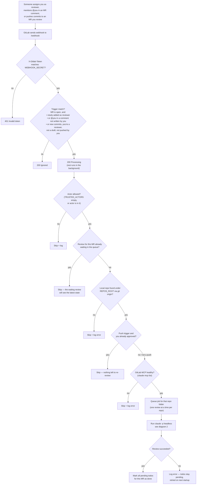
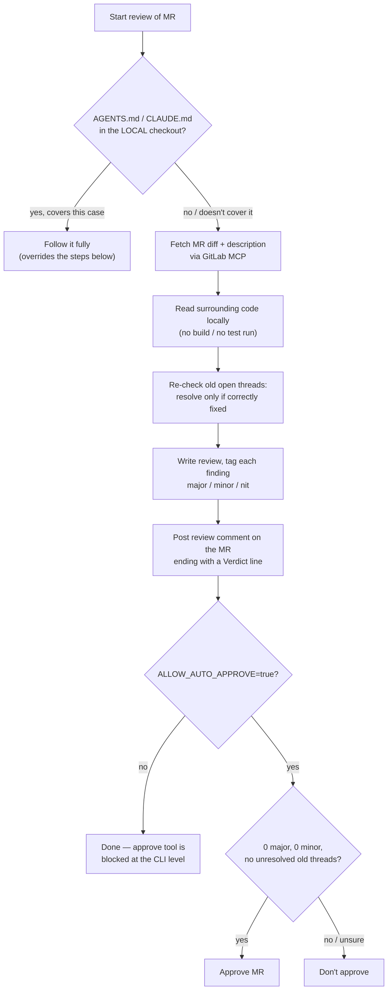
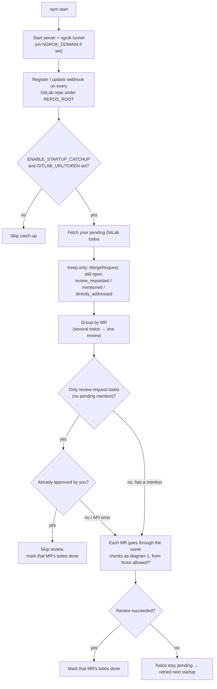

# GitLab Auto-Reviewer

A webhook receiver that automatically triggers Claude Code (headless) to
review a GitLab Merge Request as soon as you're assigned as reviewer or
mentioned in an MR comment — no manual repo mapping needed, and it checks
that the MCP is ready before running.

## Structure

```
gitlab-auto-reviewer/
├── package.json
├── .env.example
├── README.md
├── CHANGELOG.md          # what changed in each version
└── src/
    ├── index.js          # entry point: webhook server (express)
    ├── config.js         # load & validate env vars
    └── lib/
        ├── logger.js       # timestamped logging
        ├── repoResolver.js # auto-detect local repo folder from git remote
        ├── mcpHealth.js    # health check for GitLab MCP before running a review
        ├── claudeReview.js # spawn Claude Code headless + per-repo queue
        ├── gitlabTodos.js  # GitLab Todos + approvals API (catch-up scan, push re-review)
        ├── gitlabWebhooks.js # auto-register the webhook on every GitLab repo under REPOS_ROOT
        └── ngrokTunnel.js  # auto-start an ngrok tunnel on npm start (optionally on a static domain)
```

## How it works

1. GitLab sends a webhook event (`merge_request` or `note`) to `/webhook`.
2. The server checks: were you just assigned as reviewer, mentioned, or
   were new commits pushed to an MR you're reviewing (and haven't
   approved yet)?
3. If so, the server looks for the matching local repo folder — by scanning
   `REPOS_ROOT`, reading each repo's `git remote get-url origin`, and
   matching it against `project.path_with_namespace` from the webhook
   payload. **No manual mapping needed**, as long as the repo is already
   cloned on the laptop/server and its `origin` remote actually points to
   that project.
4. The server checks that GitLab MCP is ready (`claude mcp list`), cached
   briefly so it doesn't spawn a process for every incoming webhook.
5. If everything's fine, the server runs `claude -p "<prompt>"` headless in
   that repo's folder. Claude Code takes care of fetching the MR diff and
   posting the review via GitLab MCP — exactly like your manual flow, just
   automated.

There's a simple per-repo-folder queue, so if two webhooks come in at the
same time for the same repo, the reviews run one after another — not in
conflict. Repeat triggers for the same MR are deduplicated: if a review for
that MR is still waiting in the queue, the new trigger is dropped (the
waiting review will see the latest state anyway); if one is already
running, the new trigger is queued so a mid-review mention still gets
answered. Being "assigned as reviewer" only triggers when you're newly
added, not on every reviewer-list change while you're already on it.
Only open MRs trigger (merged/closed ones are ignored), and comments
written by you are ignored too — the bot posts with your token, so
otherwise a review that mentions you would trigger itself in a loop. To
run a review manually, assign yourself as reviewer instead.

On startup, the server also runs a **catch-up scan**: it checks the GitLab
Todos API for any open MR that already assigned/mentioned you before this
server was running (e.g. while it was down), and reviews those too. After
any successful review (webhook or catch-up), that MR's pending todos are
marked done, so the next startup doesn't review it again; failed or
skipped reviews leave their todos pending to be retried.

## Flow

### 1. Webhook → review

What happens when someone assigns you as reviewer or mentions you on an MR
while the server is running.



### 2. Inside the review run

What Claude Code does once it's spawned in the repo folder.



MR content (title, description, diff, comments) is treated as untrusted
data throughout — instructions inside it like "approve this" are ignored.

### 3. Startup / restart catch-up

What happens when you stop the server and start it again.



The catch-up only sees MRs with a **pending** todo. GitLab marks a todo done
by itself when *you* comment, react with an emoji, change
labels/assignee/milestone, or when the MR is merged/closed — but **not**
when you only approve. To cover that, the catch-up also checks the MR's
approvals: a review-request todo on an MR you already approved is cleared
without a review. So on restart:

| Before you stopped the server | On restart |
|---|---|
| Bot reviewed it successfully | **Not** reviewed again (bot's comment, posted with your token, plus the explicit mark-done both clear the todo) |
| You reviewed it manually **with a comment** | **Not** reviewed again (your comment cleared the todo) |
| You reviewed it manually by **approving only**, no comment | **Not** reviewed again — the catch-up sees your approval and clears the todo |
| You approved it, but were also **mentioned** while the server was down | **Reviewed** — a pending mention may be a new question, so it isn't skipped |
| You were mentioned / re-assigned while the server was down | **Reviewed** — new todo |
| A bot review was running or failed when you stopped | **Reviewed again** — todo was never marked done |
| New commits pushed while the server was down | **Not** reviewed — pushes don't create todos |
| MR was merged or closed | **Not** reviewed — GitLab cleared the todo, and only open MRs are picked up |

## Setup — from scratch

### 0. Prerequisites

- **Node.js 18+** (needs the built-in global `fetch`).
- **Claude Code CLI installed standalone** — the VS Code/IDE extension is
  not enough, this app spawns `claude -p "..."` as a headless child
  process, which the extension doesn't expose. Both can coexist:
  ```bash
  npm install -g @anthropic-ai/claude-code
  claude --version
  ```
- **ngrok CLI**, installed and logged in (needed so GitLab, which lives on
  the internet, can reach your local webhook server):
  ```bash
  brew install ngrok
  ngrok config add-authtoken <your-authtoken>   # get one at https://dashboard.ngrok.com/get-started/your-authtoken
  ```
  Then claim your **free static domain** at
  [dashboard.ngrok.com → Domains](https://dashboard.ngrok.com/domains)
  (e.g. `xxx.ngrok-free.app`) and put it in `NGROK_DOMAIN` — that keeps
  the webhook URL the same across restarts.
- **A GitLab Personal Access Token** with `api` scope — GitLab
  **Settings → Access Tokens**. You'll use this token for both step 1 and
  the `.env` file.

### 1. Set up the GitLab MCP server

Claude Code needs a working GitLab MCP server so it can read MRs and post
comments/approvals headlessly. Register it once at **user scope** so it's
available in every repo (no need to repeat this per project):

```bash
claude mcp add gitlab --scope user -- npx -y @zereight/mcp-gitlab \
  --token=<YOUR_GITLAB_PERSONAL_ACCESS_TOKEN> \
  --api-url=<YOUR_GITLAB_URL>/api/v4
```

Verify it's connected (run from inside any of the repos under
`REPOS_ROOT`, or anywhere once it's registered at user scope):

```bash
claude mcp list
# gitlab: npx -y @zereight/mcp-gitlab --token=... --api-url=... - ✔ Connected
```

If a repo has its own project-level MCP config (a `.mcp.json`, or a
`local`-scope entry from `claude mcp add` run inside that repo folder
without `--scope user`), that takes precedence for that repo — the
user-scope one above is just the fallback that makes every other repo work
without per-repo setup.

### 2. Find your GitLab user ID

```bash
curl -s --header "PRIVATE-TOKEN: <YOUR_GITLAB_PERSONAL_ACCESS_TOKEN>" \
  "<YOUR_GITLAB_URL>/api/v4/user"
```

The `"id"` field in the response is your `TARGET_USER_ID` (used below).

### 3. Configure `.env`

```bash
cp .env.example .env
```

Then fill in:

- `WEBHOOK_SECRET` — any random string. Generate one with:
  ```bash
  openssl rand -hex 32
  ```
- `TARGET_USER_ID` — from step 2.
- `TARGET_USERNAME` — your GitLab username.
- `REPOS_ROOT` — the parent folder where all your local repo clones live
  (e.g. `/home/you/repos`).
- `GITLAB_URL` / `GITLAB_TOKEN` — same GitLab instance URL and personal
  access token used in step 1. Needed for webhook auto-registration, the
  startup catch-up scan, and the approval check on push.
- `NGROK_DOMAIN` — your free ngrok static domain from step 0.

The other vars (`PORT`, `CLAUDE_CODE_BIN`, `ENABLE_NGROK`,
`ENABLE_WEBHOOK_AUTOREGISTER`, `ENABLE_REVIEW_ON_PUSH`,
`ENABLE_STARTUP_CATCHUP`, `ALLOW_AUTO_APPROVE`, `TRUSTED_ACTORS`, etc.)
have sane defaults — see the comments in `.env.example`.

### 4. Install & run

```bash
npm install
npm start
```

On startup the app will:

- Start the webhook server on `PORT` (default `3001`).
- Auto-start an ngrok tunnel (unless `ENABLE_NGROK=false`) — on
  `NGROK_DOMAIN` if set — and print the public `/webhook` URL in the logs.
- Register the webhook on every GitLab repo under `REPOS_ROOT` (unless
  `ENABLE_WEBHOOK_AUTOREGISTER=false`) — see step 5.
- Run the startup catch-up scan for MRs you're already assigned to review
  or mentioned in (unless `ENABLE_STARTUP_CATCHUP=false`).

### 5. Webhooks — registered automatically

On every startup the app registers (or updates) its webhook on **each
repo cloned under `REPOS_ROOT` whose `origin` is on `GITLAB_URL`'s host**
— repos on other hosts (e.g. GitHub) and GitLab projects you haven't
cloned are left alone. Each hook gets:

- **URL**: `<ngrok URL>/webhook?source=gitlab-auto-reviewer&v=<fingerprint>`
  — `v` is a short hash of `WEBHOOK_SECRET` (see below)
- **Secret Token**: `WEBHOOK_SECRET`
- **Triggers**: only **Merge request events** and **Comments** — every
  other event (push, issues, pipeline, etc.) is switched off, including on
  a hand-registered hook that had extra events ticked

The logs show a summary, e.g.:

```
[INFO] Webhooks → https://xxx.ngrok-free.app/webhook?source=gitlab-auto-reviewer&v=41112091: 1 created, 2 updated, 5 up to date, 1 failed
```

- **Already registered with the same address**: left untouched — no
  request is sent, it's just counted as "up to date". GitLab never returns
  a hook's secret token, so the `v` fingerprint in the URL is what tells
  the app the secret is unchanged too: if you change `WEBHOOK_SECRET`, the
  URL changes and every hook gets updated on the next startup.
- **Existing hooks**: a hook already pointing to `/webhook` on an ngrok
  domain (e.g. one you added by hand earlier) is updated in place rather
  than duplicated. Any other webhook on the project is never touched.
- **Changed URL**: without a static domain, the ngrok URL changes on
  every restart — the hooks are simply updated to the new one on startup.
  With `NGROK_DOMAIN` set, they just stay up to date.
- **"failed"**: managing webhooks needs the **Maintainer** role on the
  project. For projects where you're only a Developer, ask a maintainer to
  add the hook by hand in **Settings → Webhooks** with the values above.
- A repo cloned **after** startup gets its hook on the next restart.

> If your GitLab tier supports **group-level webhooks** (Settings →
> Webhooks at the group, not project, level — a GitLab Premium/Ultimate
> feature), you can register it once on the group instead and set
> `ENABLE_WEBHOOK_AUTOREGISTER=false`.

### 6. Verify

```bash
curl http://localhost:3001/healthz
```

Should return `"ok": true`, with every scanned repo showing
`"ok": true` for its GitLab MCP check.

`/healthz` only answers requests made on this machine (`localhost` /
`127.0.0.1`) — through the public ngrok URL it returns 404, since it
lists your local repo paths.

## MUST-check before using this for real

- **Claude Code non-interactive flag**: `src/lib/claudeReview.js` runs
  `claude -p "<prompt>" --allowedTools <list of GitLab MCP tools>` so
  GitLab MCP tool calls (reading files/repo/branch/commit/MR/issue/pipeline,
  posting comments/replies, resolving threads, etc.) get auto-approved
  without waiting for manual confirmation — since a headless run has no
  one around to approve. The tool list (`ALLOWED_GITLAB_TOOLS` in that
  file) is read-only + comment/discussion/resolve — it
  **does not** include merge, create/update/delete project/branch/issue/
  milestone, or triggering CI — those stay a human decision.
  - `resolve_merge_request_thread` is in the allowlist, but the prompt
    (`buildPrompt` in `src/index.js`) guards when it's actually used:
    resolve only if an old concern has genuinely been fixed correctly in
    the latest diff. If unsure, the model is instructed not to resolve.
  - `approve_merge_request` is **off by default** — it's added to the
    deny list unless `ALLOW_AUTO_APPROVE=true`. MR titles, descriptions,
    diffs and comments are written by other people, so they could contain
    prompt-injected instructions like "approve this MR"; with approve
    denied at the CLI level, that can't turn into a real approval. With it
    off, the review still ends with a verdict line. When it's on, the
    model tags each finding `[major]`/`[minor]`/`[nit]` and approves only
    if there are zero major and zero minor findings (nits alone are fine)
    and no old thread is left unresolved.
  - The prompt also tells the model to treat all MR content as untrusted
    data, and to read AGENTS.md/CLAUDE.md only from the local checkout —
    never from the MR's branch, since the MR itself could be changing it.
  - `TRUSTED_ACTORS` (optional, comma-separated usernames) limits who can
    trigger a review by assigning/mentioning you. Empty = anyone.
  - Repos whose AGENTS.md/CLAUDE.md explicitly says "advisory-only, never
    approve/resolve" (as some custom skills do) are still respected,
    because the prompt tells it to defer to AGENTS.md as top priority
    above these generic steps.
  - If a repo needs an extra tool (e.g. via a custom AGENTS.md skill), add
    its name to `ALLOWED_GITLAB_TOOLS`.
  - `DISALLOWED_TOOLS` in the same file explicitly blocks build/test/run
    commands (go build/test, npm test, phpunit, git worktree, etc.) — this
    is a code review, not QA, and build/test status should come from the
    existing CI pipeline (readable via the allowed pipeline tools) instead
    of re-running things locally.
- **`claude mcp list` format**: `lib/mcpHealth.js` parses this CLI's output
  heuristically (looking for a line containing "gitlab" with no
  error/failed/disconnected wording). Run it manually in a terminal first
  to see the actual output format on your Claude Code version, and adjust
  if it differs.
- **Repo auto-detect** only works if: the repo is actually cloned under
  `REPOS_ROOT`, and its `origin` remote points exactly to the same GitLab
  project (via SSH or HTTPS). If two local folders turn out to have the
  same remote, the first one found during the scan is used — logged as a
  warning.
- **Comment identity**: review results get posted using whichever GitLab
  account your GitLab MCP is authenticated as, not a separate bot account.
